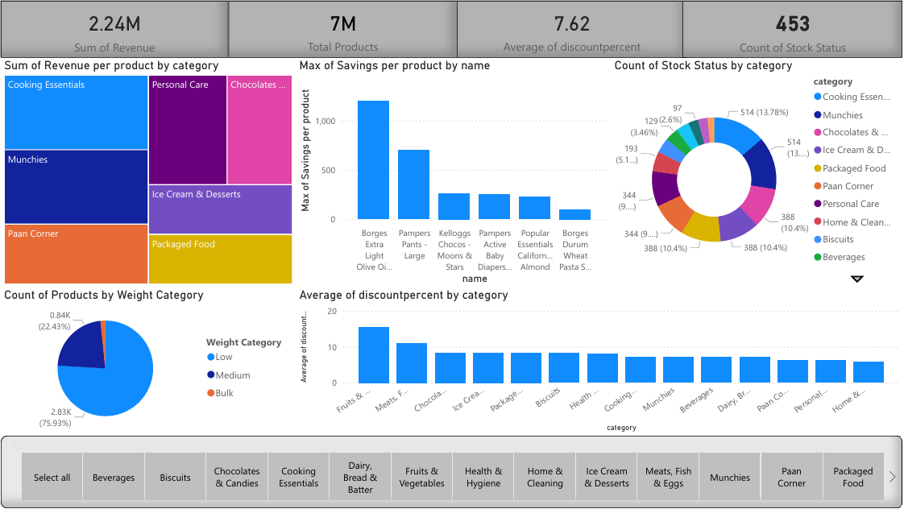

# 🛒 Zepto E-Commerce Product Analytics



> **End-to-end data analyst portfolio project** — from raw data ingestion and SQL analysis to an interactive Power BI dashboard. Built on real inventory data scraped from [Zepto](https://www.zeptonow.com/), one of India's fastest-growing quick-commerce startups.

---

## 🎯 Business Problems Solved

| Problem | Visual | Insight |
|---|---|---|
| Which categories drive most revenue? | Treemap | Cooking Essentials = highest revenue |
| Which premium products are out of stock? | Donut + KPI | 26 high-MRP products need restocking |
| Are discounts optimised across categories? | Bar chart | Some categories over-discounting by 25-32% |
| Which products offer best customer value? | Savings bar | Borges Olive Oil = highest savings =Best retention|
| How is inventory distributed by weight? | Pie chart | 80.59% Products are lightweight (<500g) |
| What is overall business health? | KPI cards | ₹2.24M revenue, 7.18% avg discount |
| Where to invest inventory? | Treemap | Cooking Essentials = 40%+ of revenue |
| What's causing revenue loss? |Savings bar | 26 out-of-stock premium products |
| Are discounts optimised? | KPI cards | 7.18% avg — room to discount more in low-performing categories |

## 📌 Table of Contents
- [Project Overview](#-project-overview)
- [Dashboard](#-dashboard)
- [Dataset Overview](#-dataset-overview)
- [Project Workflow](#-project-workflow)
- [Business Questions & SQL](#-business-questions--sql)
- [Key Insights](#-key-insights)
- [Tech Stack](#-tech-stack)
- [How to Use](#-how-to-use)

---

## 📊 Project Overview

This project simulates how real data analysts work in e-commerce and retail. Using **PostgreSQL** for analysis and **Power BI** for visualisation, the project covers:

- ✅ Real-world database setup and data ingestion
- ✅ Exploratory Data Analysis (EDA) across 3,732 product SKUs
- ✅ Data cleaning — null handling, zero-price removal, paise → rupee conversion
- ✅ 9 business-driven SQL queries using CTEs, subqueries, window functions
- ✅ Interactive Power BI dashboard with slicers and KPI cards

---

## 📈 Dashboard


📄 [View Full Dashboard PDF](zepto_dashboard.pdf)

### Dashboard KPIs
| KPI | Value |
|---|---|
| 💰 Total Estimated Revenue | ₹2.24M |
| 📦 Total Products (SKUs) | 3,732 |
| 🏷️ Average Discount | 7.18% |
| ❌ Out of Stock Products | 26 |
---

## 📁 Dataset Overview

Sourced from **Kaggle** — originally scraped from Zepto's live product listings. Each row represents a unique **SKU (Stock Keeping Unit)**. Duplicate product names exist intentionally since the same product appears across different sizes, weights, and discounts — exactly how real catalog data looks.

| Column | Type | Description |
|---|---|---|
| `sku_id` | SERIAL PK | Unique product entry identifier |
| `name` | VARCHAR(250) | Product name as shown on app |
| `category` | VARCHAR(50) | Product category |
| `mrp` | NUMERIC(8,2) | Max Retail Price (converted from paise → ₹) |
| `discountPercent` | NUMERIC(5,2) | Discount % applied on MRP |
| `discountedSellingPrice` | NUMERIC(8,2) | Final price after discount |
| `availableQuantity` | INTEGER | Units available in inventory |
| `weightInGms` | INTEGER | Product weight in grams |
| `outOfStock` | BOOLEAN | Stock availability flag |
| `quantity` | INTEGER | Units per package |

---

## 🔧 Project Workflow

### 1 — Database & Table Creation
```sql
CREATE TABLE zepto (
  sku_id                 SERIAL PRIMARY KEY,
  category               VARCHAR(50),
  name                   VARCHAR(250) NOT NULL,
  mrp                    NUMERIC(8,2),
  discountPercent        NUMERIC(5,2),
  availableQuantity      INTEGER,
  discountedSellingPrice NUMERIC(8,2),
  weightInGms            INTEGER,
  outOfStock             BOOLEAN,
  quantity               INTEGER
);
```

### 2 — Data Import
Loaded via pgAdmin import. Alternative:
```sql
\copy zepto(category, name, mrp, discountPercent, availableQuantity,
            discountedSellingPrice, weightInGms, outOfStock, quantity)
FROM 'zepto.csv'
WITH (FORMAT csv, HEADER true, DELIMITER ',', ENCODING 'UTF8');
```

### 3 — Exploratory Data Analysis
```sql
-- Total records
SELECT COUNT(*) FROM zepto;  -- 3,732 rows

-- Null check across all columns
SELECT
    COUNT(*) FILTER (WHERE name IS NULL)                   AS name_nulls,
    COUNT(*) FILTER (WHERE category IS NULL)               AS category_nulls,
    COUNT(*) FILTER (WHERE mrp IS NULL)                    AS mrp_nulls,
    COUNT(*) FILTER (WHERE discountpercent IS NULL)        AS discount_nulls,
    COUNT(*) FILTER (WHERE availablequantity IS NULL)      AS qty_nulls,
    COUNT(*) FILTER (WHERE discountedsellingprice IS NULL) AS price_nulls,
    COUNT(*) FILTER (WHERE outofstock IS NULL)             AS stock_nulls
FROM zepto;
-- Result: 0 nulls across all columns ✅
```

### 4 — Data Cleaning
```sql
-- Remove zero-price products
DELETE FROM zepto WHERE mrp = 0;

-- Convert paise to rupees
UPDATE zepto
SET mrp = mrp / 100.0,
    discountedsellingprice = discountedsellingprice / 100.0;
```

---

## 💼 Business Questions & SQL

### Q1 — Top 10 Best-Value Products by Discount
```sql
SELECT name, mrp, discountpercent
FROM zepto
ORDER BY discountpercent DESC
LIMIT 10;
```

### Q2 — High MRP Products Currently Out of Stock
```sql
SELECT name, discountedsellingprice, outofstock
FROM zepto
WHERE outofstock = TRUE AND discountedsellingprice > 300
ORDER BY discountedsellingprice DESC;
```

### Q3 — Estimated Revenue per Category
```sql
SELECT category,
       ROUND(SUM(discountedsellingprice * availablequantity), 0) AS revenue
FROM zepto
GROUP BY category
ORDER BY revenue DESC;
```

### Q4 — Expensive Products with Low Discount (MRP > ₹500, Discount < 10%)
```sql
SELECT name, mrp, discountpercent
FROM zepto
WHERE mrp > 499 AND discountpercent < 10
GROUP BY name, mrp, discountpercent
ORDER BY mrp DESC;
```

### Q5 — Top 5 Categories by Average Discount
```sql
SELECT category, ROUND(AVG(discountpercent), 2) AS avg_discount
FROM zepto
GROUP BY category
ORDER BY avg_discount DESC
LIMIT 5;
```

### Q6 — Price per Gram (Best Value Products)
```sql
SELECT name, discountedsellingprice, weightingms,
       ROUND(discountedsellingprice / weightingms, 2) AS price_per_gram
FROM zepto
WHERE weightingms > 100
GROUP BY name, discountedsellingprice, weightingms
ORDER BY price_per_gram ASC;
```

### Q7 — Product Weight Segmentation
```sql
SELECT DISTINCT name, weightingms,
CASE
    WHEN weightingms < 500  THEN 'Low'
    WHEN weightingms < 2500 THEN 'Medium'
    ELSE 'Bulk'
END AS weight_category
FROM zepto;
```

### Q8 — Total Inventory Weight per Category
```sql
SELECT category,
       CONCAT(SUM(weightingms) / 1000, ' Kg') AS total_inventory_weight
FROM zepto
GROUP BY category
ORDER BY SUM(weightingms) DESC;
```

### Q9 — Top 10 Products by Savings
```sql
SELECT name, mrp,
       SUM(mrp - discountedsellingprice) AS savings,
       discountpercent
FROM zepto
WHERE outofstock = FALSE
GROUP BY name, mrp, discountpercent
ORDER BY savings DESC
LIMIT 10;
```

---

## 🔍 Key Insights

- 🏆 **Cooking Essentials** generates the highest estimated revenue across all categories
- 💸 **Borges Extra Light Olive Oil** offers the highest absolute savings per unit
- 📦 **80.59%** of products fall in the Low weight category (under 500g)
- ❌ **26 products** are currently out of stock — mostly premium/high-MRP items
- 🏷️ Categories with highest avg discounts offer **25–32%** off MRP
- ⚖️ Bulk products (2500g+) represent only **~1%** of total SKUs

---

## 🛠️ Tech Stack

| Tool | Purpose |
|---|---|
| **PostgreSQL 15** | Database & SQL analysis |
| **pgAdmin 4** | Database GUI & data import |
| **SQL** | EDA, cleaning, business queries |
| **Power BI Desktop** | Dashboard & visualisation |

---

## 🚀 How to Use

1. **Clone the repo**
```bash
git clone https://github.com/praveenc1903/zepto-ecommerce-analysis.git
cd zepto-ecommerce-analysis
```

2. **Create database in pgAdmin**
```sql
CREATE DATABASE zepto_da_project;
```

3. **Run the SQL file**
```
Open zepto_analysis.sql in pgAdmin
→ Run all queries in order
```

4. **Import the dataset**
```
pgAdmin → zepto table → Import/Export
→ Import zepto.csv
→ Header: ON, Format: CSV, Encoding: UTF-8
```

5. **Open the dashboard**
```
Open zepto_dashboard.pbix in Power BI Desktop
```

---

## 📂 Repository Structure

```
zepto-ecommerce-analysis/
│
├── zepto_analysis.sql        ← All SQL queries
├── zepto_dashboard.pbix      ← Power BI file
├── zepto_dashboard.pdf       ← Dashboard PDF
├── zepto_dashboard.png       ← Dashboard preview
├── zepto.csv                 ← Raw dataset
└── README.md                 ← This file
```

---

## 📜 License
[MIT](LICENSE) — free to fork ⭐ and use in your own portfolio.

---

*Built to simulate real analyst workflows in e-commerce — from messy raw data to actionable business insights.*
